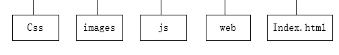
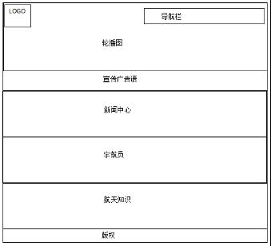
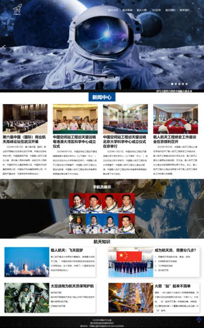
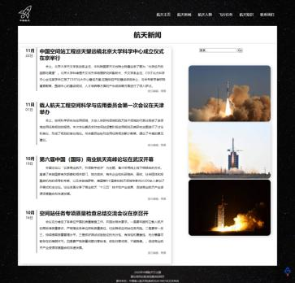
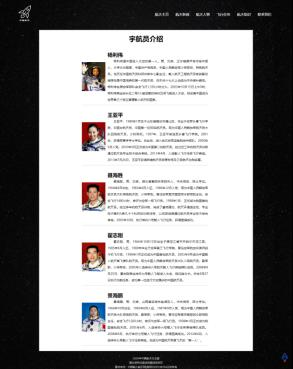
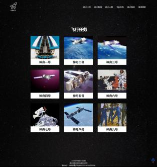
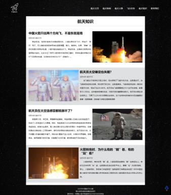
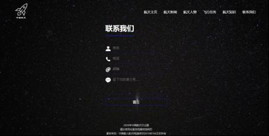

# China-Aerospace-publicity-website
###1、网页主题

网页是以2020年中国航天日主题，我的网页名称为“中国航天”，选用了深蓝色、黑色、白色3个颜色为主题色；网页主要功能是供大家了解航天航空的相关知识、浏览最近我国航天事业的新闻。

【建议】
分辨率：1366*768；
浏览器：谷歌浏览器。

2、文件夹目录结构

3、主页框架

4、LOGO

Logo由一个火箭的图标加上网站的名称“中国航天”组合而成，火箭图标既展示了我这个网站是关于航天航空的主题又祝福我国航天事业如火箭般发展迅猛；logo是PNG格式，颜色为白色，放进文档看不出，所以直接截了页面中的图。

5、导航栏

网页一共分为6个栏目，在导航栏上有做CSS特效，鼠标经过有个动态效果，上下两条边框有个往中间滑动的特效；

6、网页说明

6.1、首页

在首页的第一部分是导航栏+轮播图，导航栏用的绝对定位方式定位在顶部，利用了Javascript制作了一个轮播图，可以自动切换、左右手动切换、点击右下角圆点切换；
第二部分：制作了滚动字幕的宣传标语，设置了鼠标滑过停住，鼠标移开继续滚动属性；
第三部分：制作了四个div摆放新闻内容，每个新闻标题设置了外网的超链接并设置了鼠标滑过字体颜色变蓝色；
第四部分：宇航员展示，背景设置了固定属性，设置了CSS3样式：鼠标滑过宇航员照片，照片变大并显示相应宇航员名称；
第五部分：定义了四个小div，属性设置了浮动和阴影；
最后，版权申明，并制作了一个回到顶部的火箭图标，固定在网页的右下角。

6.2、航天新闻

导航栏、版权申明以及回到顶部是和主页一致的，将网页内容大致分了左右两块，左边放置新闻内容，每个新闻标题设置了外网链接，设置了阴影样式；右边利用表单制作了一个搜索框，接着是对图片设置了边框角度样式。

6.3航天人物

宇航员的相关简介，使用的是div嵌套排版。

6.4飞行任务

一些中国航天火箭的展示说明，设置了CSS样式为鼠标滑过图片可以展开相应航天火箭的信息，并设置了一个“更多”按钮，点击可以跳转到相应外网，按钮的样式设置了鼠标经过变小动画。

6.5航天知识

采用交错的图片和文字排列方式，使用div和float属性排版。

6.6联系我们

利用表单制作了一个用户留言功能，设置了文本框和按钮的value值和背景为空样式。

7、网页后期维护

保持网站的正常运行；定期做好网站的数据备份；实时发布和更新网站内容。

8、心得体会

首先是浏览了相关航天网页查看关于航天主题需要哪些内容，进而确定了导航栏的内容，接着是思考好网页的布局，再通过查找网页样式资料视频等对自己的网页加以修饰，整个网页制作过程中，难点是网页布局的尺寸把控，要经过多次细微的调整才能达到自己想要的效果。经过这次综合设计，加深了HTML+CSS+JavaScript的了解，希望自己以后能学有所用。

